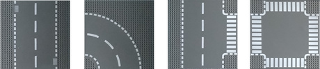

# LegoCityRoad


##### Table of Contents  
* [Introduction](#introduction)
* [Usage and examples](#usage-and-examples)
  * [The most simple](#the-most-simple)
  * [A reasonable size set](#a-reasonable-size-set)
* [Performance](#performance)

## Introduction

Do you have Lego road plates? Do you want to know what roads you are able to build out of them? Here the help is coming!

legocityroad.py is a python script building up all the possible combinations of closed roads of a given set of Lego road plates (using all of the plates). There are only 4 types of plates the straight, the simple turn, the T crossing and the 4 way crossing (called X crossing from here).




## Usage and examples

Use the following options to tell the script what plates you have:
 * --straight &lt;n&gt;
 * --turn &lt;n&gt;
 * --tcross &lt;n&gt;
 * --xcross &lt;n&gt;

The output will be a unicode text, where every road plate is one character:
```
─  │  ╭  ╮  ╰  ╯  ┼  ┤  ┴  ├  ┬

```

### The most simple

You need at least 4 turns to make a closed road

```
$ ./legocityroad.py  --turn 4
 Number of plates:
    straight = 0
    turn     = 4
    T-cross  = 0
    X-cross  = 0
    total    = 4


Found a new solution! Size: 2x2 (1)
╭╮
╰╯
```

### A reasonable size set
```
./legocityroad.py --straight 4 --turn 6 --tcross 2 --xcross 2
 Number of plates:
    straight = 4
    turn     = 6
    T-cross  = 2
    X-cross  = 2
    total    = 14


Found a new solution! Size: 6x3 (1)
 ╭╮
╭┼┤
╰┼┤
 ││
 ││
 ╰╯

Found a new solution! Size: 6x3 (2)
 ╭╮
╭┼┤
├┼╯
││
││
╰╯

Found a new solution! Size: 3x6 (3)
  ╭┬─╮
╭─┼┼─╯
╰─┴╯

Found a new solution! Size: 5x4 (4)
  ╭╮
╭─┼┤
╰─┼┤
  ││
  ╰╯

Found a new solution! Size: 4x5 (5)
   ╭╮
╭──┼┤
╰──┼┤
   ╰╯

Found a new solution! Size: 4x4 (6)
 ╭─╮
╭┼─┤
╰┼─┤
 ╰─╯

Found a new solution! Size: 3x6 (7)
  ╭╮
╭─┼┼─╮
╰─┴┴─╯

 ------ All solutions (7) ------
 --- Non rectangle, symmetric shapes without hole(s) (4) ---
3x6      3x6      4x4    4x5
  ╭┬─╮     ╭╮      ╭─╮      ╭╮
╭─┼┼─╯   ╭─┼┼─╮   ╭┼─┤   ╭──┼┤
╰─┴╯     ╰─┴┴─╯   ╰┼─┤   ╰──┼┤
                   ╰─╯      ╰╯

 --- Irregular shapes without holes (3) ---
3x6      3x6      4x5
   ╭┬╮      ╭╮      ╭╮
╭──┼┼╯   ╭──┼┼╮     ││
╰──┴╯    ╰──┴┴╯   ╭─┼┼╮
                  ╰─┴┴╯
```

## Performance

It is surprisingly hard (meaning requires lots of CPU power) to make all the possible combination of plates if you have many plates and 20 plates may be already many... The example picture above here contains 2 straight roads, 6 turns, 6 T-crosses and 4 X-crosses (18 plates in total). This road set has 56 solutions and takes about 23 minutes on my Intel Core i7-5820K desktop computer (3.30GHz, 6 cores, 12 threads) to have all the solutions.

With a bit bigger set: 4 straight, 6 turns, 6 T-crosses, 4 X-crosses, total 20 plates, only 2 more than in the previous one, the runtime is 6 hours 10mins on the same PC (and 168 solutions).

The legocityroad.py script uses multiprocessing by default, so the runtime heavily depends on the number of cores you have.

