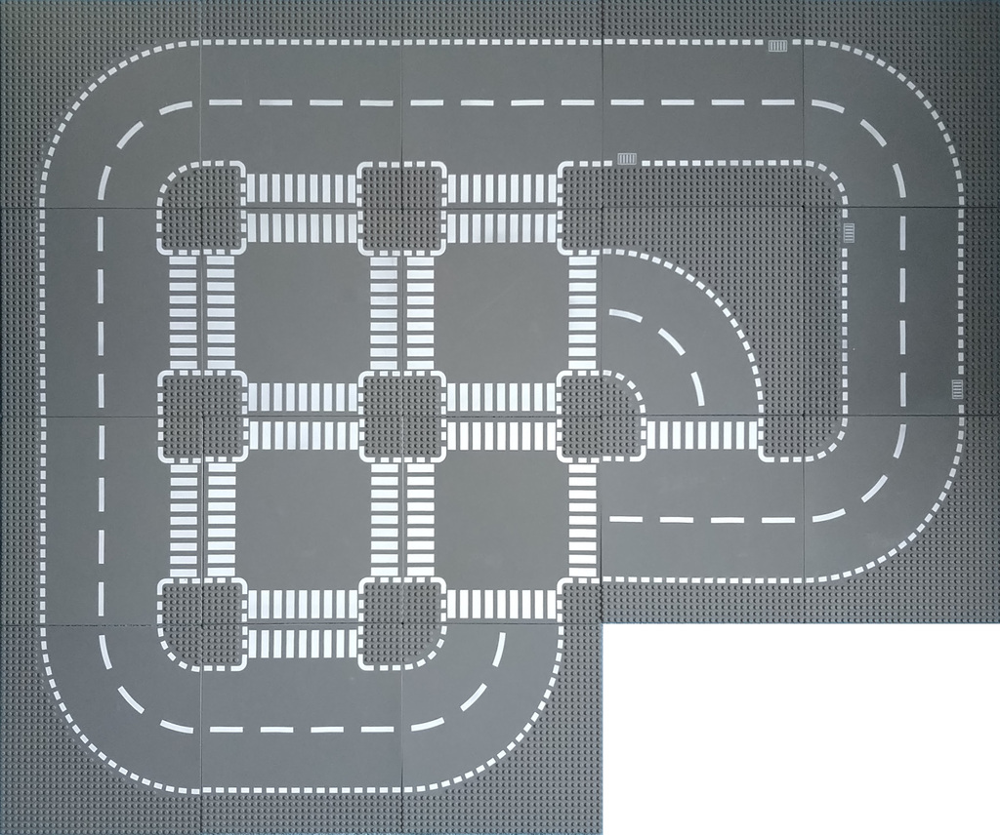

# LegoCityRoad



## Introduction

Do you have Lego road plates? Do you want to know what roads you are able to build of them? Here the help is coming!

legocityroad.py is a python script building up all the possible combinations of closed roads of a given set of Lego road plates.

## Usage and examples
There are 4 types of plates the strait, the simple turn, the T crossing and the 4 way crossing (called X crossing from here)

Use the following options to tell the script what plates you have:
 * --straight &lt;n&gt;
 * --turn &lt;n&gt;
 * --tcross &lt;n&gt;
 * --xcross &lt;n&gt;

The output will be a unicode text, where every road plate is one character:
```
─  │  ╭  ╮  ╰  ╯  ┼  ┤  ┴  ├  ┬

```

### The most simple

You need at least 4 turns to make a closed road

```
$ ./legocityroad.py  --turn 4
 Number of plates:
    straight = 0
    turn     = 4
    T-cross  = 0
    X-cross  = 0
    total    = 4


Found a new solution! Size: 2x2 (1, 75%)
╭╮
╰╯
```

### A reasonable size set
```
./legocityroad.py --straight 4 --turn 6 --tcross 2 --xcross 2
 Number of plates:
    straight = 4
    turn     = 6
    T-cross  = 2
    X-cross  = 2
    total    = 14


Found a new solution! Size: 6x3 (1)
 ╭╮
╭┼┤
╰┼┤
 ││
 ││
 ╰╯

Found a new solution! Size: 6x3 (2)
 ╭╮
╭┼┤
├┼╯
││
││
╰╯

Found a new solution! Size: 3x6 (3)
  ╭┬─╮
╭─┼┼─╯
╰─┴╯

Found a new solution! Size: 5x4 (4)
  ╭╮
╭─┼┤
╰─┼┤
  ││
  ╰╯

Found a new solution! Size: 4x5 (5)
   ╭╮
╭──┼┤
╰──┼┤
   ╰╯

Found a new solution! Size: 4x4 (6)
 ╭─╮
╭┼─┤
╰┼─┤
 ╰─╯

Found a new solution! Size: 3x6 (7)
  ╭╮
╭─┼┼─╮
╰─┴┴─╯

 ------ All solutions (7) ------
 --- Non rectangle, symmetric shapes without hole(s) (4) ---
3x6      3x6      4x4    4x5
  ╭┬─╮     ╭╮      ╭─╮      ╭╮
╭─┼┼─╯   ╭─┼┼─╮   ╭┼─┤   ╭──┼┤
╰─┴╯     ╰─┴┴─╯   ╰┼─┤   ╰──┼┤
                   ╰─╯      ╰╯

 --- Irregular shapes without holes (3) ---
3x6      3x6      4x5
   ╭┬╮      ╭╮      ╭╮
╭──┼┼╯   ╭──┼┼╮     ││
╰──┴╯    ╰──┴┴╯   ╭─┼┼╮
                  ╰─┴┴╯
```


